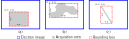

# Oxford Instruments NanoAnalysis HDF5 File Specification

Version | Release AZtec Version
--- | ---
1.0 | AZtec 4.2
2.0 | AZtec 4.3
3.0 | AZtec 5.0
4.0 | AZtec 5.1
5.0 | AZtec 6.0
6.0 | AZtec 6.1 SP1
7.0 | AZtec 6.2

This document details the specification for the Oxford Instruments NanoAnalysis HDF5 file format (_.h5oina_).
It is using the [Hierarchical Data Format 5](http://www.hdfgroup.org) file format library, which has several implementations in different programming languages.
The file format is largely influenced by the H5EBSD file format developed by Jackson et al. (2014) [[doi](http://dx.doi.org/10.1186/2193-9772-3-4)].
More details about the guiding principles used in the design of this file format and its scope of use within the microanalysis community can be found in this M&M abstract [[doi](http://dx.doi.org/10.1017/S1431927621006103)].

This file format can be used to export:
 - Electron images
 - EDS maps
 - EDS smartMaps
 - EDS line scans
 - EDS smartLines
 - EBSD maps
 - EBSD line scans
 - Combined EDS/EBSD maps
 - Combined EDS/EBSD line scans
 - Processed or unprocessed EBSPs
 - Particle analysis data.

## Table of Content

- [General Notes](#general-notes)
- [What's New](#whatsnew)
- [AZtec Project Data Tree](#data-tree)
- File Layout
  - [Root Level](#root-level)
  - [Slice](#slice)
  - [Technique](#technique)
  - [Common Header](#common-header)
  - [EBSD](#ebsd)
    - [Data](#ebsd-data)
    - [Header](#ebsd-header)
  - [EDS](#eds)
    - [Data](#eds-data)
    - [Header](#eds-header)
  - [Electron Image](#electronimage)
    - [Data](#electronimage-data)
    - [Header](#electronimage-header)
  - [Layered Image](#layeredimage)
    - [Data](#layeredimage-data)
    - [Header](#layeredimage-header)
  - [Data Processing](#dataprocessing)
    - [Data](#dataprocessing-data)
    - [Header](#dataprocessing-header)
    - [Analyses](#dataprocessing-analyses)

##  General Notes

- All datasets containing physical quantities have an attribute *Unit* specifying the unit of the values. Note that this does not imply that different units might be use for a given dataset. The *Unit* attribute is only a hint to allow users to know the unit used in the dataset.
- All angles are expressed in _Radians_.
- Euler angles follow the Bunge convention ZXZ, i.e. +Z  +X'  +Z''.
- Each dataset defining Euler angles contains three columns, one for each Euler angle.
- All datasets and attributes of type H5T_STRING are encoded as UTF8 (see [H5T_CSET_UTF8](https://confluence.hdfgroup.org/display/HDF5/H5T_SET_CSET)).
- Each dataset defining color(s) contains three columns for the red, green and blue components.
- An _.h5oina_ file may not contain all the datasets specified in this specification. Different hardware and acquisition conditions mean that some parameters are not available, and therefore cannot be exported. The mandatory datasets are indicated below.
- In the Data datasets, the value of pixels outside the acquisition area is set to `NaN`.
- Some datasets use LZF compression. See [HDF5 Filter Plugins](https://portal.hdfgroup.org/display/support/HDF5+Filter+Plugins) and [LZF Compression Filter for HDF5](http://www.h5py.org/lzf/) for more information. :label: New in version 5.0

##  What's New

* 7.0
  * Add various optional datasets to EBSD Header group, including Acquired Pattern Width and Height to support reduced-size patterns export
  * Add Phase Group Id, Pseudo Symmetry and Reference Spectrum datasets to EBSD Phase group
  * Add Processed and Unprocessed Virtual Forescatter Detector Images datasets to EBSD Data group
  * Add Mixing Mode attribute on BSE electron image dataset that contains the topography mode used to acquire that image with Unity systems
  * Add the ability to export spectral data both EDS smartMaps and EDS smartLines.
* 6.0
  * Add support for Unity, including export of multidetector systems with Unity and an auxillary detector.
* 5.0
  * Add support for electron backscatter diffraction patterns (EBSPs)
  * Add support for feature/particle analysis
* 4.0
  * Add support for layered images
* 3.0
  * Add support for line scans
  * Add metadata about bounding box
* 2.0
  * Add support for electron image and data processing techniques
  * Add support for EDS only acquisitions
  * Add the palette of EDS maps
* 1.0
  * First release

##  AZtec Project Data Tree

Here is how the AZtec data are exported to _.h5oina_.
An AZtec project is normally structured using _Specimen_ and _Site_.
A _Site_ may contain one or more acquisitions like ED spectra, ED mappings, EDS mappings, EBSD mappings, electron images, etc.
If the user decides to export the whole project to _.h5oina_, an _.h5oina_ file would be created for each acquisition.
For instance, the following project would be exported as three _.h5oina_ files: one for _Map Data 1_, another for _Map Data 2_ and a final one for _Line Data 1_.
Note that the EDS and EBSD data of the _Map Data 1_ are stored in the same _.h5oina_ file.
_Electron Image 1_ and _Electron Image 2_ are stored in all the _.h5oina_ files.

:label: Added in version 3.0 support for line scans
 :label: Added in version 2.0 support for electron images and EDS only acquisitions

AZtec project:

- Project 1
  - Specimen 1
    - Site 1
      - Electron Image 1
      - Electron Image 2
      - Map Data 1
        - EBSD Data
        - EDS Data
      - Map Data 2
        - EBSD Data
      - Line Data 1
        - EDS Data

_.h5oina_ files:

- Project 1 Specimen 1 Site 1 Map Data 1.h5oina
- Project 1 Specimen 1 Site 1 Map Data 2.h5oina
- Project 1 Specimen 1 Site 1 Line Data 1.h5oina

## File Layout

###  Root Level Specification

Each file has the following datasets under the root level.

**Dataset Name** | **Mandatory** | **HDF5 Type** | **Dimension (row, column)** | **Comment**
--- | --- | --- | --- | ---
Manufacturer | | H5T_STRING | (1, 1) | i.e. _Oxford Instruments_
Software Version | | H5T_STRING | (1, 1) | Version of software used to create this file
Format Version | yes | H5T_STRING | (1, 1) | Version of this file format
Index | yes | H5T_STRING | (number of slices, 1) | List of the name of the slices (i.e. acquisitions) contained in this file. The attribute **Type** specifies to which type of acquisition the index corresponds to. Possible values are: _Single_ or _Feature_. For particle analysis, the Index corresponds to the index of each feature.  :label: Type attribute added in version 5.0

###  Slice Group Specification

:label: Particle analysis acquisition added in version 5.0

Each Slice (i.e. acquisition) has its own H5G_GROUP with the Name of the group as the index of the slice.
The name of all the slices is given in the Index dataset in the root level.
At the moment, _.h5oina_ supports two types of acquisition (see Type attribute of the Index dataset in the root level):

  1. Single acquisition (e.g., EDS map, EBSD map, EBSD line scan, etc.) where only one acquisition is stored per file. The file only contains one Slice, labelled _1_
  2. Particle analysis acquisition where each slice corresponds to one analyzed feature.

Within each Slice group there is at least one Technique group, representing the technique used for the acquisition.
A Slice group can contain several Technique groups.
Note that there is no _Feature_ technique; the particle analysis data and meta-data are stored in the [EDS](#eds) and [Electron Image](#electronimage) techniques.
The techniques can be, but not restrictive to:

**Group Name** | **Mandatory** | **Comment**
--- | --- | ---
[EBSD](#ebsd) | | Contains one EBSD acquisition
[EDS](#eds) | | Contains one EDS acquisition, if there are multiple EDS acquistions e.g. from a multidetector with Unity systems they are numbered EDS1, EDS2 etc.  :label: Labelling new in version 6.0
[Electron Image](#electronimage) | | Contains electron images associated with the EDS and/or EBSD acquisition  :label: New in version 2.0
[Layered Image](#layeredimage) | | Contains composite images made of layers from EDS, EBSD and/or electron images  :label: New in version 4.0
[Data Processing](#dataprocessing) | | Contains results created by data processing software, such as AZtec Crystal  :label: New in version 2.0

###  Technique Group Specification

Each technique group contains two groups with names **Data** and **Header**.

**Group Name** | **Mandatory** | **Comment**
--- | --- | ---
Data | yes | Contains all the data columns
Header | yes | Contains all the header entries

###  Common Header Group Specification

The following groups are common to the header group of all techniques.

**Group Name** | **Mandatory** | **Comment**
--- | --- | ---
[Stage Position](#stage-position) | | Contains datasets about the stage position of this acquisition
[Feature](#feature) | | Contains datasets about the feature from particle analysis  :label: New in version 5.0

The following datasets are common to the header group of all techniques.

**Dataset Name** | **Mandatory** | **HDF5 Type** | **Dimension (row, column)** | **Comment**
--- | --- | --- | --- | ---
Acquisition Date | | H5T_STRING | (1, 1) | Acquisition date/time as ISO8601, yyyy-MM-ddTHH:mm:ss
Project Label | yes | H5T_STRING | (1, 1) | AZtec project name
Project Notes | | H5T_STRING | (1, 1) |
Project File | | H5T_STRING | (1, 1) |
Specimen Label | | H5T_STRING | (1, 1) | Label of specimen containing this acquisition
Specimen Notes | | H5T_STRING | (1, 1) |
Site Label | | H5T_STRING | (1, 1) | Label of site containing this acquisition
Site Notes | | H5T_STRING | (1, 1) |
Analysis Label | | H5T_STRING | (1, 1) | Label of this acquisition
Analysis Unique Identifier | | H5T_STRING | (1, 1) | Unique identifier of this acquisition. It is unique across any AZtec project.
Magnification | | H5T_NATIVE_FLOAT | (1, 1) |
Beam Voltage | | H5T_NATIVE_FLOAT | (1, 1) | In kilovolts
Working Distance | | H5T_NATIVE_FLOAT | (1, 1) | Working distance of microscope (in millimeters)
Tilt Angle | | H5T_NATIVE_FLOAT | (1, 1) | Tilt angle of sample (either from stage tilt or pre-tilted holder)
Tilt Axis | | H5T_NATIVE_FLOAT | (1, 1) | 0 for x-axis, &pi;/2 for y-axis
X Cells | yes | H5T_NATIVE_INT32 | (1, 1) | Map: Width in pixels. Line scan: Length in pixels.
Y Cells | yes | H5T_NATIVE_INT32 | (1, 1) | Map: Height in pixels. Line scan: Always set to 1.
X Step | yes | H5T_NATIVE_FLOAT | (1, 1) | Map: Step size along x-axis in micrometers. Line scan: step size along the line scan in micrometers.
Y Step | yes | H5T_NATIVE_FLOAT | (1, 1) | Map: Step size along y-axis in micrometers. Line scan: Always set to 0.
Drift Correction | | H5T_NATIVE_HBOOL | (1, 1) | Whether drift correction was used during this acquisition
Bounding Box Size | | H5T_NATIVE_FLOAT | (1, 2) | Size (width, height) of the bounding box surrounding the acquisition in micrometers. See [Definition of Bounding Box Size, Relative Offset and Relative Size](#bounding-box) for more information.  :label: New in version 3.0
Relative Offset | | H5T_NATIVE_FLOAT | (1, 2) | Top-left corner of the bounding box of the acquisition in the electron image. The X coordinate is normalized by the __width__ of the electron image. The Y coordinate is normalized by the __height__ of the electron image. See [Definition of Bounding Box Size, Relative Offset and Relative Size](#bounding-box) for more information.  :label: New in version 3.0
Relative Size | | H5T_NATIVE_FLOAT | (1, 2) | Size of the bounding box of the acquisition in the electron image. The width is normalized by the __width__ of the electron image. The height is normalized by the __height__ of the electron image. See [Definition of Bounding Box Size, Relative Offset and Relative Size](#bounding-box) for more information.  :label: New in version 3.0
Feature Index | | H5T_NATIVE_INT32 | (1, 1) | Index of feature from particle analysis.  :label: New in version 5.0
Feature Parent Index | | H5T_NATIVE_INT32 | (1, 1) | If the feature was reacquired during a particle analysis acquisition, this index corresponds to the index of the parent feature. If a feature was not reacquired, the Feature Parent Index has a value of -1.  :label: New in version 5.0
Feature Reconstructed | | H5T_NATIVE_BOOL | (1, 1) | Whether the feature from particle analysis was reconstructed.  :label: New in version 5.0

####  Stage Position Group Specification

The Stage Group contains the following datasets.

**Dataset Name** | **Mandatory** | **HDF5 Type** | **Dimension (row, column)** | **Comment**
--- | --- | --- | --- | ---
X | yes | H5T_NATIVE_FLOAT | (1, 1) | In millimeters  :label: Changed in version 2.0 to mandatory
Y | yes | H5T_NATIVE_FLOAT | (1, 1) | In millimeters  :label: Changed in version 2.0 to mandatory
Z | | H5T_NATIVE_FLOAT | (1, 1) | In millimeters
Tilt | | H5T_NATIVE_FLOAT | (1, 1) | Tilt angle of the stage in radians
Rotation | | H5T_NATIVE_FLOAT | (1, 1) | Rotation angle of the stage in radians

####  Feature Group Specification

:label: New in version 5.0

The Feature Group contains the following datasets.

**Dataset Name** | **Mandatory** | **HDF5 Type** | **Dimension (row, column)** | **Comment**
--- | --- | --- | --- | ---
Phase Index | | H5T_NATIVE_INT32 | (1, 1) | Index of the phase of the feature. If no phase was detected, the Phase Index has a value of -1.
Class | | H5T_STRING | (1, 1) | Primary classification of the feature.
Subclasses | | H5T_STRING | (*, 1) | Addition sub-classification(s) of the feature.

####  Definition of Bounding Box Size, Relative Offset and Relative Size

:label: New in version 3.0

The Bounding Box Size specifies the dimensions of the rectangle enclosing the acquisition area. 
The figure below shows examples of the bounding box for a (a) rectangular map, (b) irregular-shaped map and (c) line scan.
Note for irregular-shaped maps, the value of pixels outside the acquisition area in the Data group datasets is set to `NaN`.

The Relative Offset specifies the position of the top-left corner of the bounding box in the electron image.
The X and Y coordinates are respectively normalized by the width and height of the electron image.
The Relative Size specifies the dimensions of the bounding box in the electron image.
The width and height are respectively normalized by the width and height of the electron image.
The values of the relative offset and size for the 3 examples are shown in the figure below.

###  EBSD Technique

####  Data Group Specification

The number of rows (first dimension of array) of all datasets is equal to the size of the acquisition. For example, width x height for maps and length for line scans.
In other words, it is equal to the total number of pixels in the acquisition.

The EBSD Data Group contains the following datasets.

**Dataset Name** | **Mandatory** | **HDF5 Type** | **Dimension (row, column)** | **Comment**
--- | --- | --- | --- | ---
Phase | yes | H5T_NATIVE_UINT8 | (size, 1) | Index of phase, 0 if not indexed
X | | H5T_NATIVE_FLOAT | (size, 1) | X position of each pixel in micrometers (origin: top left corner)
Y | | H5T_NATIVE_FLOAT | (size, 1) | Y position of each pixel in micrometers (origin: top left corner)
Bands | | H5T_NATIVE_UINT8 | (size, 1) | Number of bands positively indexed
Error | | H5T_NATIVE_UINT8 | (size, 1) | Error code. Some of these codes are historical and no longer apply. NotAnalyzed=0, Success=1, NoSolution=2, LowBandContrast=3, LowBandSlope=4, HighMAD=5, UnexpectedError=6, Replaced=7
Euler | yes | H5T_NATIVE_FLOAT | (size, 3) | Orientation of Crystal (CS2) to Sample-Surface (CS1). See [Definition of Coordinate Systems](#coordinate-systems) for more information.
Mean Angular Deviation | | H5T_NATIVE_FLOAT | (size, 1) | In radians
Band Contrast | | H5T_NATIVE_UINT8 | (size, 1) |
Band Slope | | H5T_NATIVE_UINT8 | (size, 1) |
Pattern Quality | | H5T_NATIVE_FLOAT | (size, 1) |
Pattern Center X | | H5T_NATIVE_FLOAT | (size, 1) | Pattern center X position scaled to the width of the image. This means that an X value of 0.5 is in the middle on the horizontal axis of the image. The origin is in the bottom left corner.
Pattern Center Y | | H5T_NATIVE_FLOAT | (size, 1) | Pattern center Y position scaled to the width of the image. Note that for a non-square image a Y value of 0.5 is _not_ in the center of the vertical axis of the image. The origin is in the bottom left corner.
Detector Distance | | H5T_NATIVE_FLOAT | (size, 1) | Detector distance scaled to the width of the image.
Beam Position X | | H5T_NATIVE_FLOAT | (size, 1) | X position of the beam in the real-world (in micrometers). The origin is in the center of the image, and a mathematical Y axis that is positive when going from bottom to top
Beam Position Y | | H5T_NATIVE_FLOAT | (size, 1) | Y position of the beam in the real-world (in micrometers). The origin is in the center of the image, and a mathematical Y axis that is positive when going from bottom to top
Unprocessed Patterns | | H5T_NATIVE_INT16 | (size, height, width) | Raw patterns without any background subtraction. The 2nd and 3rd dimension of the dataset correspond to the correspond to the height and width of the patterns, respectively. They also match the **Pattern Height** and **Pattern Width** datasets in the Header. This dataset uses [LZF compression](https://portal.hdfgroup.org/display/support/HDF5+Filter+Plugins).  :label: New in version 5.0
Processed Patterns | | H5T_NATIVE_UINT8 | (size, height, width) | Patterns after background subtraction. See **Static Background Correction** and **Auto Background Correction** datasets in the Header. The 2nd and 3rd dimension of the dataset correspond to the correspond to the height and width of the patterns, respectively. They also match the **Pattern Height** and **Pattern Width** datasets in the Header. This dataset uses [LZF compression](https://portal.hdfgroup.org/display/support/HDF5+Filter+Plugins).  :label: New in version 5.0
Unprocessed Virtual Forescatter Detector Images | | H5T_NATIVE_INT16 | (size, height, width) | Raw virtual forescatter detector images without any background subtraction.  :label: New in version 7.0
Processed Virtual Forescatter Detector Images | | H5T_NATIVE_UINT8 | (size, height, width) | Virtual forescatter detector images after background subtraction.  :label: New in version 7.0

####  Header Group Specification

Apart from the [common header specification](#common-header), the EBSD Header Group contains the following groups.

**Group Name** | **Mandatory** | **Comment**
--- | --- | ---
Phases | yes | Contains a subgroup for each [phase](#ebsd-phase) where the name of each subgroup is the index of the phase starting at **1**.

Apart from the [common header specification](#common-header), the EBSD Header Group contains the following datasets.

**Dataset Name** | **Mandatory** | **HDF5 Type** | **Dimension (row, column)** | **Comment**
--- | --- | --- | --- | ---
Detector Orientation Euler | | H5T_NATIVE_FLOAT | (1, 3) | Orientation of Detector (CS3) to Microscope (CSm). See [Definition of Coordinate Systems](#coordinate-systems) for more information.
Detector Insertion Distance | | H5T_NATIVE_FLOAT | (1, 1) | Insertion distance of EBSD detector in millimeters
Lens Distortion | | H5T_NATIVE_FLOAT | (1, 1) |
Lens Field View | | H5T_NATIVE_FLOAT | (1, 1) | In millimeters
Camera Mode | | H5T_STRING | (1, 1) | For example, "4x4"  :label: Changed from "Camera Binning Mode" in version 7.0
Camera Exposure Time | | H5T_NATIVE_FLOAT | (1, 1) | In milliseconds
Camera Gain | | H5T_NATIVE_FLOAT | (1, 1) |
Number Frames Averaged | | H5T_NATIVE_INT32 | (1, 1) |
Detector Serial Number | | H5T_STRING | (1, 1) | :label: New in version 7.0
Acquired Pattern Width | | H5T_NATIVE_INT32 | (1, 1) | Width of the acquired diffraction pattern images in pixels  :label: New in version 7.0
Acquired Pattern Height | | H5T_NATIVE_INT32 | (1, 1) | Height of the acquired diffraction pattern images in pixels  :label: New in version 7.0
Patterns Storage Condition | | H5T_STRING | (1, 1) | :label: New in version 7.0
Pattern Width | | H5T_NATIVE_INT32 | (1, 1) | Width of the stored diffraction pattern images in pixels
Pattern Height | | H5T_NATIVE_INT32 | (1, 1) | Height of the stored diffraction pattern images in pixels
Virtual Forescatter Detector Image Width | | H5T_NATIVE_INT32 | (1, 1) | Width of the virtual forescatter detector images in pixels  :label: New in version 7.0
Virtual Forescatter Detector Image Height | | H5T_NATIVE_INT32 | (1, 1) | Height of the virtual forescatter detector images in pixels  :label: New in version 7.0
Static Background Correction | | H5T_NATIVE_HBOOL | (1, 1) | Whether a static background correction was applied
Processed Static Background | | H5T_NATIVE_UINT8 | (height, width) | Image used for the static background correction. The height and width correspond to the **Pattern Height** and **Pattern Width** datasets, respectively.  :label: New in version 5.0
Unprocessed Static Background | | H5T_NATIVE_INT16 | (height, width) | Image used for the static background correction. The height and width correspond to the **Pattern Height** and **Pattern Width** datasets, respectively.  :label: New in version 5.0
Auto Background Correction | | H5T_NATIVE_HBOOL | (1, 1) | Whether an automatic background correction was applied
Hough Resolution | | H5T_NATIVE_INT32 | (1, 1) | &Delta;&rho; is equal to 1 / (2 * Hough Resolution + 1) and &Delta;&theta; is equal to &pi; / (2 * Hough Resolution + 1)
Band Detection Mode | | H5T_STRING | (1, 1) | Either _Center_ or _Edge_, if the **Indexing Mode** is _Standard BD_.
Number Bands Detected | | H5T_NATIVE_INT32 | (1, 1) |
Indexing Mode | | H5T_STRING | (1, 1) | Either _Standard BD_, _Optimized BD_ or _Refined Accuracy_. In **Version** 3.0 and earlier, either _Optimized - EBSD_, _Optimized - TKD_ or _Refined Accuracy_.
Hit Rate | | H5T_NATIVE_FLOAT | (1, 1) | Hit rate, percentage of indexed pixels
Acquisition Time | | H5T_NATIVE_FLOAT | (1, 1) | In seconds
Acquisition Speed | | H5T_NATIVE_FLOAT | (1, 1) | In pixels per second  :label: New in version 2.0
Specimen Orientation Euler | yes | H5T_NATIVE_FLOAT | (1, 3) | Orientation of Sample-Surface (CS1) to Sample-Primary (CS0). See [Definition of Coordinate Systems](#coordinate-systems) for more information.
Scanning Rotation Angle | yes | H5T_NATIVE_FLOAT | (1, 1) | Angle between the specimen tilt axis and the scanning tilt axis in radians. If NaN, the angle is unknown.
Band Detection Circle Center X | | H5T_NATIVE_FLOAT | (1, 1) | Normalized to the width of the image with the origin in the top left corner  :label: New in version 7.0
Band Detection Circle Center Y | | H5T_NATIVE_FLOAT | (1, 1) | Normalized to the width of the image with the origin in the top left corner  :label: New in version 7.0
Band Detection Circle Radius | | H5T_NATIVE_FLOAT | (1, 1) | Normalized to the width of the image with the origin in the top left corner  :label: New in version 7.0
Solution Refinement Delta Working Distance | | H5T_NATIVE_FLOAT | (1, 1) | In millimeters  :label: New in version 7.0
Solution Refinement Delta Insertion Distance | | H5T_NATIVE_FLOAT | (1, 1) | In millimeters  :label: New in version 7.0
Magnetic Field Correction | | H5T_NATIVE_HBOOL | (1, 1) | Whether magnetic field correction was used  :label: New in version 7.0
Shadow Masking Correction | | H5T_NATIVE_HBOOL | (1, 1) | Whether shadow masking correction was used  :label: New in version 7.0
Saturation Masking Correction | | H5T_NATIVE_HBOOL | (1, 1) | Whether saturation masking correction was used  :label: New in version 7.0
Diffraction Spot Masking Correction | | H5T_NATIVE_HBOOL | (1, 1) | Whether diffraction spot masking correction was used  :label: New in version 7.0
Use TruPhase | | H5T_NATIVE_HBOOL | (1, 1) | Whether TruPhase option was used  :label: New in version 7.0
Detector Screen Type | | H5T_STRING | (1, 1) | Either _Standard_ or _NA-TKD_  :label: New in version 7.0

#####  Phase Group Specification

Each phase group is defined by the following datasets.

**Dataset Name** | **Mandatory** | **HDF5 Type** | **Dimension (row, column)** | **Comment**
--- | --- | --- | --- | ---
Phase Name | yes | H5T_STRING | (1, 1) |
Reference | yes | H5T_STRING | (1, 1) | :label: Changed in version 2.0 to mandatory
Lattice Angles | yes | H5T_NATIVE_FLOAT | (1, 3) | Three columns for the alpha, beta and gamma angles in radians
Lattice Dimensions | yes | H5T_NATIVE_FLOAT | (1, 3) | Three columns for a, b and c dimensions in Angstroms
Laue Group | yes | H5T_NATIVE_INT32 | (1, 1) | Laue group index. The attribute **Symbol** contains the string representation, for example _m-3m_.
Space Group | | H5T_NATIVE_INT32 | (1, 1) | Space group index. The attribute **Symbol** contains the string representation, for example _P m -3 m_.
Number Reflectors | | H5T_NATIVE_INT32 | (1, 1) | Number of reflectors
Color | | H5T_NATIVE_UINT8 | (1, 3) | Three columns for the RGB values
Database Id | | H5T_NATIVE_INT32 | (1, 1) | Id of the database where this phase was taken from  :label: New in version 2.0
Phase Id | | H5T_NATIVE_INT32 | (1, 1) | Id of the phase in the database  :label: New in version 2.0
Phase Group Id | | H5T_NATIVE_INT32 | (1, 1) | If phase grouping was defined, Id of the group associated with this phase  :label: New in version 7.0
Pseudo Symmetry | | H5T_STRING | (1, 1) | If phase pseudo-symmetry was defined, the name of the pseudo-symmetry definition associated with this phase  :label: New in version 7.0
Reference Spectrum | | H5T_STRING | (1, 1) | If EDS reference spectrum was defined, the name of the EDS reference spectrum associated with this phase  :label: New in version 7.0

####  Definition of Coordinate Systems

An orientation is quantified by a set of rotations whereby one coordinate system (CS) is rotated to coincidence with another CS.
Depending on the application, it might be desirable to express an orientation relative to a specific CS.
Five coordinate systems are defined:

**CS** | **Name** | **Description**
--- | --- | ---
CSm | Microscope stage | Follows the naming convention from the stage (XY)
CS0 | Sample primary | For a rolled sheet of metal, this would be the rolling, tranverse, normal (RTN) system. In geology this could be the foliation, lineation system seen in some layered rocks.
CS1 | Sample surface | Surface from where we acquire the EBSD measurements
CS2 | Crystal | Follows the convention: Z parallel to c axis of the unit cell, X perpendicular to b and c axes of the unit cell and Y perpendicular to X and Z.
CS3 | EBSD detector | The EBSD detector is position sensitive, in the way that the EBSP changes as we change the position of the detector in the SEM.

The absolute crystal orientation is given by the orientation of the crystal (CS2) to the sample surface (CS1).

###  EDS Technique ###

####  Data Group Specification ####

There will either be one data group labelled EDS or multiple data groups labelled EDS1, EDS2 etc (for multidetector systems including Unity data).

The number of rows (first dimension of array) of all datasets is equal to the size of the acquisition. For example, width x height for maps, length for line scans and 1 for single point.
In other words, it is equal to the total number of pixels in the acquisition.

The EDS Data Group contains at least one of the following groups.

**Group Name** | **Mandatory** | **Comment**
--- | --- | ---
Window Integral | | Contains one dataset for each element and X-ray line analysed (e.g. Al Ka1). Each value (stored as H5T_NATIVE_FLOAT) corresponds to the integral of the raw X-ray counts over an energy window divided by the live time. The units are counts per second.
Peak Area | | Contains one dataset for each element and X-ray line analysed (e.g. Al K series). Each value (stored as H5T_NATIVE_FLOAT) corresponds to the fitted peak area divided by the live time. The units are counts per second.
Composition | | Contains one dataset for each element analysed (e.g. Al). Each value (stored as H5T_NATIVE_FLOAT) corresponds to the concentration, expressed in wt%.
Composition Sigma | | Contains one dataset for each element analysed (e.g. Al). Each value (stored as H5T_NATIVE_FLOAT) corresponds to the uncertainty on the concentration (1-sigma), expressed in wt%.  :label: New in version 5.0
Apparent Concentration | | Contains one dataset for each element analysed (e.g. Al). Each value (stored as H5T_NATIVE_FLOAT) corresponds to the first estimate of the concentration of an element before any matrix corrections are calculated and applied, expressed in wt%. The apparent concentration is defined as (intensity sample) / (intensity standard) * (wt.% standard).  :label: New in version 5.0
K Ratio | | Contains one dataset for each element analysed (e.g. Al). Each value (stored as H5T_NATIVE_FLOAT) corresponds to the k-ratio, defined as (intensity sample) / (intensity standard).  :label: New in version 5.0

Each dataset in the Window Integral and Peak Area groups have the following attributes.

**Attribute Name** | **Mandatory** | **HDF5 Type** | **Dimension (row, column)** | **Comment**
--- | --- | --- | --- | ---
Atomic Number | yes | H5T_NATIVE_INT32 | (1, 1) | Atomic number of analysed element
X-ray Line | yes | H5T_STRING | (1, 1) | X-ray line analysed (e.g. Ka1, K series)
Lower Value | yes | H5T_NATIVE_FLOAT | (1, 1) | Lower value of the palette associated with this dataset (in counts per second)  :label: New in version 2.0
Lower Color | yes | H5T_NATIVE_UINT8 | (1, 3) | Three columns for the RGB values of the color associated with the lower value  :label: New in version 2.0
Upper Value | yes | H5T_NATIVE_FLOAT | (1, 1) | Upper value of the palette associated with this dataset (in counts per second)  :label: New in version 2.0
Upper Color | yes | H5T_NATIVE_UINT8 | (1, 3) | Three columns for the RGB values of the color associated with the upper value  :label: New in version 2.0
Gamma | yes | H5T_NATIVE_FLOAT | (1, 1) | One over the exponent of the [gamma correction](https://en.wikipedia.org/wiki/Gamma_correction) used to create the palette associated with this dataset: I' = I ^ (1 / gamma), where I is the intensity and I', the corrected intensity  :label: New in version 2.0

Each dataset in the Composition, Composition Sigma, K Ratio, Apparent Concentration groups have the following attributes:

**Attribute Name** | **Mandatory** | **HDF5 Type** | **Dimension (row, column)** | **Comment**
--- | --- | --- | --- | ---
Atomic Number | yes | H5T_NATIVE_INT32 | (1, 1) | Atomic number of analysed element
Lower Value | yes | H5T_NATIVE_FLOAT | (1, 1) | Lower value of the palette associated with this dataset (in wt%)  :label: New in version 2.0
Lower Color | yes | H5T_NATIVE_UINT8 | (1, 3) | Three columns for the RGB values of the color associated with the lower value  :label: New in version 2.0
Upper Value | yes | H5T_NATIVE_FLOAT | (1, 1) | Upper value of the palette associated with this dataset (in wt%)  :label: New in version 2.0
Upper Color | yes | H5T_NATIVE_UINT8 | (1, 3) | Three columns for the RGB values of the color associated with the upper value  :label: New in version 2.0
Gamma | yes | H5T_NATIVE_FLOAT | (1, 1) | One over the exponent of the [gamma correction](https://en.wikipedia.org/wiki/Gamma_correction) used to create the palette associated with this dataset: I' = I ^ (1 / gamma), where I is the intensity and I', the corrected intensity  :label: New in version 2.0

The EDS Data Group also contains the following datasets.

**Dataset Name** | **Mandatory** | **HDF5 Type** | **Dimension (row, column)** | **Comment**
--- | --- | --- | --- | ---
X | | H5T_NATIVE_FLOAT | (size, 1) | X position of each pixel in micrometers (origin: top left corner)
Y | | H5T_NATIVE_FLOAT | (size, 1) | Y position of each pixel in micrometers (origin: top left corner)
Live Time | yes | H5T_NATIVE_FLOAT | (size, 1) | In seconds
Real Time | | H5T_NATIVE_FLOAT | (size, 1) | In seconds
Spectrum | | H5T_NATIVE_INT32 | (size, channels) | Spectrum of each pixel, with the raw intensities in counts. Each pixel spectrum is represented by one row. Data set is 2D even if the spectrum data cube is 3D. See **Number Channels** in the Header for the 2nd dimension. This dataset uses [LZF compression](https://portal.hdfgroup.org/display/support/HDF5+Filter+Plugins). Now available for all EDS data sets  :label: New in version 7.0

####  Header Group Specification ####

Apart from the [common header specification](#common-header), the EDS Header Group contains the following datasets.

**Dataset Name** | **Mandatory** | **HDF5 Type** | **Dimension (row, column)** | **Comment**
--- | --- | --- | --- | ---
Channel Width | yes | H5T_NATIVE_FLOAT | (1, 1) | Width of channel in electronvolt
Start Channel | yes | H5T_NATIVE_FLOAT | (1, 1) | Value of channel zero in electronvolt
Process Time | | H5T_NATIVE_INT32 | (1, 1) | Process time used
Number Frames | | H5T_NATIVE_INT32 | (1, 1) | Number of frames acquired during the acquisition
Energy Range | | H5T_NATIVE_FLOAT | (1, 1) | Energy range used in kiloelectronvolt
Number Channels | | H5T_NATIVE_INT32 | (1, 1) | Number of channels in spectrum
Detector Elevation | | H5T_NATIVE_FLOAT | (1, 1) | Angle of ED detector from XY plane in radians
Detector Azimuth | | H5T_NATIVE_FLOAT | (1, 1) | Angle between the tilt direction (90deg from tilt axis) and detector plane in radians
Detector Serial Number | | H5T_STRING | (1, 1) |
Detector Type Id | | H5T_NATIVE_INT32 | (1, 1) | Attribute **Name** gives friendly name of detector
Processor Type | | H5T_STRING | (1, 1) | Name of pulse processor
Window Type | | H5T_STRING | (1, 1) | Description of the window
Strobe FWHM | | H5T_NATIVE_FLOAT | (1, 1) | Full width half maximum of strobe in electronvolts
Strobe Area | | H5T_NATIVE_INT32 | (1, 1) | Number of counts in the strobe peak
Binning | | H5T_NATIVE_INT32 | (1, 1) | Binning factor from the original data

###  Electron Image Technique ###

:label: New in version 2.0

####  Data Group Specification ####

The Electron Image Data Group contains at least one of the following groups, but may also contain two or all three.
Each group contains one or more datasets corresponding to electron images acquired before, during or after the ED/EBSD acquisition.
There is no requirement for the name of the datasets.
The dataset may take different HDF5 types depending on the depth of the electron images: H5T_NATIVE_UINT8, H5T_NATIVE_UINT16, etc.
BSE image dataset can have **Mixing Mode** attribute which takes one of the following values: _None_, _Compo_, _Topo 1_, _Topo 2_, _Inverted_. :label: Attribute added in version 7.0

The number of rows (first dimension of array) of all datasets is equal to the size of the image (i.e. width x height).
In other words, it is equal to the total number of pixels in the image.
All images in the Data Group have the same dimensions.

**Group Name** | **Mandatory** | **Comment**
--- | --- | ---
SE | | Contains electron image(s) acquired by a secondary electron detector(s)
BSE | | Contains electron image(s) acquired by a backscatter electron detector(s)
FSE | | Contains electron image(s) acquired by forward scatter electron detector(s)

:label: New in version 5.0

The Electron Image Data Group may also contain a Feature group with the following datasets based on the morphological measurements during particle analysis.

**Dataset Name** | **Mandatory** | **HDF5 Type** | **Dimension (row, column)** | **Comment**
--- | --- | --- | --- | ---
Area | | H5T_NATIVE_FLOAT | (1, 1) | The area of the feature, in square micrometers.
Aspect Ratio | | H5T_NATIVE_FLOAT | (1, 1) | The ratio of the length of the feature in pixels to the breadth of the feature in pixels.
Breadth | | H5T_NATIVE_FLOAT | (1, 1) | The shortest linear dimension of the feature, determined as a result of the determination of the feret diameter, in micrometers.
Direction | | H5T_NATIVE_FLOAT | (1, 1) | The angular direction of the line corresponding through the feret diameter, as measured counterclockwise from the origin in radians.
Equivalent Circular Diameter | | H5T_NATIVE_FLOAT | (1, 1) | The diameter of the circle with an area equal to the area of the detected feature, in micrometers.
Length | | H5T_NATIVE_FLOAT | (1, 1) | The longest linear dimension of the feature, determined as a result of the determination of the Feret diameter, in micrometers.
Perimeter | | H5T_NATIVE_FLOAT | (1, 1) | The perimeter of the feature, determined by the sum of all the incremental steps in the diagonal and orthogonal vector directions in traversing the feature's boundary pixels (discrete Crofton formula result), in micrometers.
Shape | | H5T_NATIVE_FLOAT | (1, 1) | A quantified approximation to the shape of the feature, equal to the perimeter squared, divided by 4 * Pi * Area. A shape of 1 corresponds to a perfectly circular feature. More elongated features are represented by greater magnitude values of shape.
Gray Level Mean | | H5T_NATIVE_FLOAT | (1, 1) | Mean gray level value for the feature.

####  Header Group Specification ####

Apart from the [common header specification](#common-header), the Electron Image Header Group contains the following datasets.

**Dataset Name** | **Mandatory** | **HDF5 Type** | **Dimension (row, column)** | **Comment**
--- | --- | --- | --- | ---
Number Frames Averaged | | H5T_NATIVE_INT32 | (1, 1) |
Dwell Time | | H5T_NATIVE_FLOAT | (1, 1) | Dwell time in microseconds

###  Layered Image Technique ###

:label: New in version 4.0

Note that an additional group level is added in this technique.
The *Layered Image* group does not directly contain *Data* and *Header* groups, but a group for each layered image associated with an acquisition
(e.g., "EDS Layered Image 1" or "EBSD Layered Image 1").
This additional group level is required as each layered image might have different header entries.
####  Data Group Specification ####

The number of rows (first dimension of array) of all datasets is equal to the size of the acquisition.
For example, width x height for maps and length for line scans.
In other words, it is equal to the total number of pixels in the acquisition.

The Layered Image Data Group contains the following datasets.

**Dataset Name** | **Mandatory** | **HDF5 Type** | **Dimension (row, column)** | **Comment**
--- | --- | --- | --- | ---
Color | yes | H5T_NATIVE_UINT8 | (size, 3) | Three columns for the RGB values. The dataset has two attributes: **Layers** and **Weights**. **Layers** attribute indicates the name of the layers, whereas **Weights** attribute gives their relative weight.

####  Header Group Specification ####

The Layered Image Header Group only contains the datasets from the [common header specification](#common-header).

###  Data Processing Technique ###

:label: New in version 2.0

This group contains results created by data processing software, such as AZtec Crystal.
One reason for this group is to never overwrite the original datasets in EBSD and EDS Technique Groups.
If operations such as cleaning are performed in the data processing software, the modified datasets are stored in this Group.

####  Data Group Specification ####

The number of rows (first dimension of array) of all datasets is equal to the size of the acquisition (i.e. width x height).
In other words, it is equal to the total number of pixels in the acquisition.

The Data Processing Data Group contains the following datasets, which is a subset of the datasets in the [EBSD Data Group](#ebsd-data).

**Dataset Name** | **Mandatory** | **HDF5 Type** | **Dimension (row, column)** | **Comment**
--- | --- | --- | --- | ---
Phase | yes | H5T_NATIVE_UINT8 | (size, 1) | Index of phase, 0 if not indexed
Euler | yes | H5T_NATIVE_FLOAT | (size, 3) | Orientation of Crystal (CS2) to Sample-Surface (CS1). See [Definition of Coordinate Systems](#coordinate-systems) for more information.
Mean Angular Deviation | | H5T_NATIVE_FLOAT | (size, 1) | In radians

####  Header Group Specification ####

The Data Processing Header Group contains the following datasets.

**Dataset Name** | **Mandatory** | **HDF5 Type** | **Dimension (row, column)** | **Comment**
--- | --- | --- | --- | ---
Specimen Symmetry | | H5T_STRING | (1, 1) | Triclinic, Monoclinic or Orthorhombic
Sample Primary Direction Labels | | H5T_STRING | (3, 1) | Labels associated to the directions of the Sample-Primary coordinate system (CS0). See [Definition of Coordinate Systems](#coordinate-systems) for more information.  :label: New in version 3.0
Sample Surface Direction Labels | | H5T_STRING | (3, 1) | Labels associated to the directions of the Sample-Surface coordinate system (CS1). See [Definition of Coordinate Systems](#coordinate-systems) for more information.  :label: New in version 3.0
Specimen Orientation Euler | | H5T_NATIVE_FLOAT | (1, 3) | Orientation of Sample-Surface (CS1) to Sample-Primary (CS0). See [Definition of Coordinate Systems](#coordinate-systems) for more information.
Scanning Rotation Angle | | H5T_NATIVE_FLOAT | (1, 1) | Angle between the specimen tilt axis and the scanning tilt axis in radians. If NaN, the angle is unknown.

The Data Processing Header Group only contains the following group:

**Group Name** | **Mandatory** | **Comment**
--- | --- | ---
Phases | yes | Contains a subgroup for each [phase](#ebsd-phase) where the name of each subgroup is the index of the phase starting at **1**.

####  Analyses Group Specification ####

The Analyses group contains analysis results obtained by post-processing the EBSD, EDS or Electron Image data.
Each subgroup corresponds to one _type of analysis_ performed with some parameters.
If the same _type of analysis_ was performed with different parameters (e.g. grain identification with different detection angles), the results are stored in different subgroups (e.g. Grain Detection 1, Grain Detection 2).

As the EBSD, EDS and Electron Image techniques, each Analysis contains a Header and Data group.
The Header group contains datasets with the parameters used for the analysis, whereas the Data group contains datasets with the calculated values.
The Header group always contains the following mandatory datasets:

**Dataset Name** | **Mandatory** | **HDF5 Type** | **Dimension (row, column)** | **Comment**
--- | --- | --- | --- | ---
Analysis Type | yes | H5T_STRING | (1, 1) | Type of the analysis, currently: Grain Detection, Kernel Average Misorientation, Inverse Pole Figure
X Cells | yes | H5T_NATIVE_INT32 | (1, 1) | Map: Width in pixels. Line scan: Length in pixels.
Y Cells | yes | H5T_NATIVE_INT32 | (1, 1) | Map: Height in pixels. Line scan: Always set to 1.
X Step | yes | H5T_NATIVE_FLOAT | (1, 1) | Map: Step size along x-axis in micrometers. Line scan: step size along the line scan in micrometers.
Y Step | yes | H5T_NATIVE_FLOAT | (1, 1) | Map: Step size along y-axis in micrometers. Line scan: Always set to 0.

Here are some examples of type of analysis and their parameters.

##### Grain Detection

Apart from the common header datasets, the Grain Detection Header Group contains the following datasets.

**Dataset Name** | **Mandatory** | **HDF5 Type** | **Dimension (row, column)** | **Comment**
--- | --- | --- | --- | ---
Minimum Angle | yes | H5T_NATIVE_FLOAT | (1, 1) | Critical misorientation angle in radians above which a boundary is declared
Close Boundaries | yes | H5T_NATIVE_HBOOL | (1, 1) |
Close Boundaries Angle | yes | H5T_NATIVE_FLOAT | (1, 1) |

The Grain Detection Header Group also contains the following group.

**Group Name** | **Mandatory** | **Comment**
--- | --- | ---
Special Boundaries | yes | Contains a subgroup for each special boundary definition where the name of each subgroup is the index of the special boundary starting at **1**.

Each Special Boundary group contains the following datasets.

**Dataset Name** | **Mandatory** | **HDF5 Type** | **Dimension (row, column)** | **Comment**
--- | --- | --- | --- | ---
Phase | yes | H5T_NATIVE_UINT8 | (1, 1) | Index of the associated phase
Axis | yes | H5T_NATIVE_FLOAT | (1, 3) | Axis of the axis/angle representation
Angle | yes | H5T_NATIVE_FLOAT | (1, 1) | Angle of the axis/angle representation in radians
Maximum Deviation Angle | yes | H5T_NATIVE_FLOAT | (1, 1) | Maximum deviation angle from the special boundary in radians
Color | | H5T_NATIVE_UINT8 | (1, 3) | Three columns for the RGB values to draw special boundary
Line Thickness | | H5T_NATIVE_INT32 | (1, 1) | Line thickness to draw special boundary

The Grain Detection Data Group contains the following datasets.
The Crystallite Index dataset is only included if special boundaries are defined.
In both Grain Index and Crystallite Index datasets, each grain is assigned a unique index.

**Dataset Name** | **Mandatory** | **HDF5 Type** | **Dimension (row, column)** | **Comment**
--- | --- | --- | --- | ---
Grain Index | yes | H5T_NATIVE_INT32 | (size, 1) | Index of each grain including the special boundaries (if any)
Crystallite Index | | H5T_NATIVE_INT32 | (size, 1) | Index of each grain without the special boundaries

##### Kernel Average Misorientation

Apart from the common header datasets, the Kernel Average Misorientation Header Group contains the following datasets.

**Dataset Name** | **Mandatory** | **HDF5 Type** | **Dimension (row, column)** | **Comment**
--- | --- | --- | --- | ---
Kernel Size | yes | H5T_STRING | (1, 1) | Kernel dimensions (e.g. "3x3")
Kernel Shape | yes | H5T_STRING | (1, 1) | "Circle" or "Square"
Maximum Angle | yes | H5T_NATIVE_FLOAT | (1, 1) | Critical misorientation angle above which misorientations are discarded in radians
Only Periphery | yes | H5T_NATIVE_HBOOL | (1, 1) | Whether only the pixels at the periphery of the kernel are included in the misorientation calculation

The Kernel Average Misorientation Data Group contains the following datasets.

**Dataset Name** | **Mandatory** | **HDF5 Type** | **Dimension (row, column)** | **Comment**
--- | --- | --- | --- | ---
Misorientation Angle | yes | H5T_NATIVE_FLOAT | (size, 1) | Misorientation angles in radians

##### Inverse Pole Figure

Apart from the common header datasets, the Inverse Pole Figure Header Group contains the following datasets.

**Dataset Name** | **Mandatory** | **HDF5 Type** | **Dimension (row, column)** | **Comment**
--- | --- | --- | --- | ---
Sample Direction | yes | H5T_STRING | (1, 1) | X, Y or Z
Phase | yes | H5T_NATIVE_UINT8 | (number of phases, 1) | Index of the phase(s)

The Inverse Pole Figure Data Group contains the following datasets.

**Dataset Name** | **Mandatory** | **HDF5 Type** | **Dimension (row, column)** | **Comment**
--- | --- | --- | --- | ---
Color | yes | H5T_NATIVE_UINT8 | (1, 3) | Three columns for the RGB values
